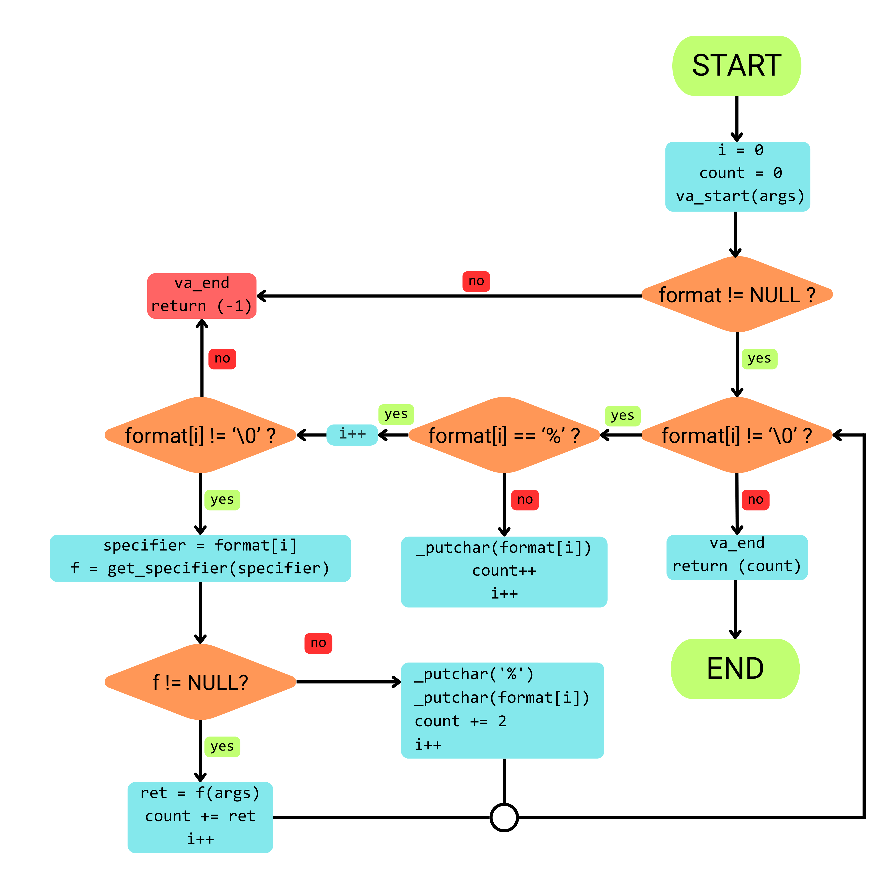

# _printf

A custom implementation of the C standard library function `printf()`, built from scratch as part of the Holberton School low-level programming curriculum.

## Description

This project recreates the core functionality of the `printf()` function in C, implementing format parsing, conversion specifier dispatching, variadic argument handling, and character-level output. The implementation demonstrates fundamental concepts in systems programming, including variadic functions, function pointers, string parsing, and low-level I/O operations.

## Features

- ✅ Variable argument list handling with `stdarg.h`
- ✅ Format string parsing and processing
- ✅ Multiple conversion specifiers support
- ✅ NULL pointer handling for strings
- ✅ Error detection and validation
- ✅ Character count tracking
- ✅ Modular architecture with function pointer dispatch table

## Prototype

```c
int _printf(const char *format, ...);
```

## Supported Conversion Specifiers

| Specifier | Description | Example | Status |
|-----------|-------------|---------|--------|
| `%c` | Prints a single character | `_printf("%c", 'A')` → `A` | ✅ Implemented |
| `%s` | Prints a string | `_printf("%s", "Hello")` → `Hello` | ✅ Implemented |
| `%%` | Prints a literal percent sign | `_printf("100%%")` → `100%` | ✅ Implemented |
| `%d` | Prints a signed decimal integer | `_printf("%d", 42)` → `42` | ✅ Implemented |
| `%i` | Prints a signed integer | `_printf("%i", -42)` → `-42` | ✅ Implemented |
| `%u` | Prints an unsigned decimal integer | `_printf("%u", 42)` → `42` | ✅ Implemented |
| `%o` | Prints an unsigned octal number | `_printf("%o", 42)` → `52` | ✅ Implemented |
| `%x` | Prints an unsigned hexadecimal (lowercase) | `_printf("%x", 255)` → `ff` | ✅ Implemented |
| `%X` | Prints an unsigned hexadecimal (uppercase) | `_printf("%X", 255)` → `FF` | ✅ Implemented |
| `%b` | Prints an unsigned binary number | `_printf("%b", 5)` → `101` | ✅ Implemented |

## Requirements

### General
- **OS:** Linux (Ubuntu 20.04 LTS or compatible)
- **Compiler:** gcc 4.8.4 or later
- **Compilation flags:** `-Wall -Werror -Wextra -pedantic -std=gnu89`
- **Coding style:** Betty style checker compliant
- **Standard:** C89/ANSI C

### Allowed Functions
- `write` (from `unistd.h`)
- `malloc`, `free` (from `stdlib.h`)
- `va_start`, `va_arg`, `va_end`, `va_copy` (from `stdarg.h`)

## Installation & Compilation

### Clone the repository
```bash
git clone https://github.com/ValentinCA28/holbertonschool-printf.git
cd holbertonschool-printf
```

### Compile
```bash
gcc -Wall -Werror -Wextra -pedantic -std=gnu89 *.c -o printf_test
```

### Run
```bash
./printf_test
```

## Usage Examples

### Basic Usage

```c
#include "main.h"

int main(void)
{
    _printf("Hello, World!\n");
    return (0);
}
```
**Output:** `Hello, World!`

### Multiple Format Specifiers

```c
#include "main.h"

int main(void)
{
    char letter = 'X';
    char *name = "Holberton";
    
    _printf("Character: %c\n", letter);
    _printf("String: %s\n", name);
    _printf("Progress: 95%%\n");
    
    return (0);
}
```
**Output:**
```
Character: X
String: Holberton
Progress: 95%
```

### Return Value

```c
#include "main.h"

int main(void)
{
    int count;
    
    count = _printf("Testing the function!\n");
    _printf("Printed %d characters\n", count);
    
    return (0);
}
```
**Output:**
```
Testing the function!
Printed 22 characters
```

### NULL String Handling

```c
#include "main.h"

int main(void)
{
    char *ptr = NULL;
    
    _printf("Value: %s\n", ptr);
    return (0);
}
```
**Output:** `Value: (null)`

### Number Conversions

```c
#include "main.h"

int main(void)
{
    unsigned int num = 255;
    int neg = -42;
    
    /* Decimal */
    _printf("Decimal: %d\n", 42);
    _printf("Integer: %i\n", neg);
    
    /* Unsigned */
    _printf("Unsigned: %u\n", num);
    
    /* Octal */
    _printf("Octal: %o\n", num);
    
    /* Hexadecimal */
    _printf("Hex (lowercase): %x\n", num);
    _printf("Hex (uppercase): %X\n", num);
    
    /* Binary (custom specifier) */
    _printf("Binary: %b\n", 5);
    
    return (0);
}
```
**Output:**
```
Decimal: 42
Integer: -42
Unsigned: 255
Octal: 377
Hex (lowercase): ff
Hex (uppercase): FF
Binary: 101
```

## Project Structure

```
holbertonschool-printf/
├── main.h                  # Header file with prototypes and structures
├── _printf.c               # Main function entry point
├── _core_printf.c          # Core parsing and formatting engine
├── find_specifier.c        # Specifier dispatcher with function pointer table
├── print_char.c            # Handler for %c conversion
├── print_str.c             # Handler for %s conversion
├── print_percent.c         # Handler for %% conversion
├── print_s_int.c           # Handler for %d and %i conversion
├── print_uns_int.c         # Handler for %u conversion
├── print_hex.c             # Handler for %x conversion (lowercase)
├── print_HEX.c             # Handler for %X conversion (uppercase)
├── print_oct.c             # Handler for %o conversion (octal)
├── print_bin.c             # Handler for %b conversion (binary)
├── print_unsigned_base.c   # Generic unsigned base conversion utility
├── _putchar.c              # Low-level character output function
├── man_3_printf            # Manual page
├── README.md               # Project documentation
└── images/                 # Visual resources
    └── Flowchart.png       # Function flowchart diagram
```

## Architecture

### 1. Entry Point (`_printf`)
- Initializes the variadic argument list using `va_start`
- Calls the core printf engine
- Cleans up with `va_end`
- Returns the total character count

### 2. Core Engine (`_core_printf`)
- Iterates through the format string character by character
- Prints regular characters directly
- Detects '%' and identifies conversion specifiers
- Dispatches to appropriate handler functions
- Handles errors (NULL format, incomplete specifiers)

### 3. Specifier Dispatcher (`get_specifier`)
- Uses a structure-based function pointer table
- Maps format specifiers to their handler functions
- Returns NULL for unsupported specifiers

### 4. Handler Functions
Each conversion specifier has its own dedicated handler:
- **`print_char`:** Prints a single character from `va_arg`
- **`print_str`:** Prints a string with NULL protection
- **`print_percent`:** Prints a literal '%' character
- **`print_s_int`:** Prints signed decimal integers (%d, %i)
- **`print_uns_int`:** Prints unsigned decimal integers (%u)
- **`print_hex`:** Prints lowercase hexadecimal (%x)
- **`print_HEX`:** Prints uppercase hexadecimal (%X)
- **`print_oct`:** Prints octal numbers (%o)
- **`print_bin`:** Prints binary numbers (%b - custom specifier)
- **`print_unsigned_base`:** Generic utility for base conversion

### Function Pointer Table

```c
typedef struct specifier
{
    char c;                      /* Format specifier character */
    int (*f)(va_list args);      /* Pointer to handler function */
} spe_tab;
```

## Error Handling

| Error Condition | Behavior |
|----------------|----------|
| NULL format string | Returns -1 |
| Incomplete specifier (ends with '%') | Returns -1 |
| NULL string pointer for %s | Prints "(null)" |
| Unknown specifier | Prints '%' + character literally |

## Return Value

- **Success:** Number of characters printed (excluding null terminator)
- **Error:** -1 if format is NULL or ends with incomplete specifier

## Testing

Example comprehensive test file:

```c
#include "main.h"
#include <stdio.h>

int main(void)
{
    int len, len2;
    unsigned int ui = 2147483647;
    
    /* Basic tests */
    len = _printf("Let's try to printf a simple sentence.\n");
    len2 = printf("Let's try to printf a simple sentence.\n");
    
    /* Character tests */
    _printf("Character: [%c]\n", 'H');
    printf("Character: [%c]\n", 'H');
    
    /* String tests */
    _printf("String: [%s]\n", "I am a string !");
    printf("String: [%s]\n", "I am a string !");
    
    _printf("NULL string: [%s]\n", NULL);
    printf("NULL string: [%s]\n", (char *)NULL);
    
    /* Percent tests */
    _printf("Percent: [%%]\n");
    printf("Percent: [%%]\n");
    
    /* Integer tests */
    _printf("Decimal: [%d]\n", 1024);
    printf("Decimal: [%d]\n", 1024);
    
    _printf("Negative: [%i]\n", -762534);
    printf("Negative: [%i]\n", -762534);
    
    /* Unsigned tests */
    _printf("Unsigned: [%u]\n", ui);
    printf("Unsigned: [%u]\n", ui);
    
    /* Octal tests */
    _printf("Octal: [%o]\n", 1024);
    printf("Octal: [%o]\n", 1024);
    
    /* Hexadecimal tests */
    _printf("Hex lower: [%x]\n", 255);
    printf("Hex lower: [%x]\n", 255);
    
    _printf("Hex upper: [%X]\n", 255);
    printf("Hex upper: [%X]\n", 255);
    
    /* Binary tests (custom specifier) */
    _printf("Binary: [%b]\n", 98);
    
    /* Length comparison */
    _printf("Length: [%d, %i]\n", len, len2);
    printf("Length: [%d, %i]\n", len, len2);
    
    return (0);
}
```

### Compile and Run Tests
```bash
gcc -Wall -Werror -Wextra -pedantic -std=gnu89 *.c -o test
./test
```

## Flowchart

Visual representation of the `_printf()` function logic:



### Flow Description:

1. **START** - Function entry point
2. **Initialize** - Set `i = 0`, `count = 0`, call `va_start(args)`
3. **NULL Check** - Verify format string is not NULL
   - If NULL → `va_end`, return `-1`, END
4. **Main Loop** - While `format[i] != '\0'`:
   - **Check for '%'**:
     - If NO → `_putchar(format[i])`, `count++`, `i++`
     - If YES → Move to specifier handling
5. **Specifier Handling**:
   - `i++` (move past '%')
   - Check if `format[i] != '\0'`
     - If `'\0'` → `va_end`, return `-1` (incomplete specifier)
   - Get specifier: `f = get_specifier(format[i])`
   - Check if `f != NULL`:
     - If YES → `ret = f(args)`, `count += ret`, `i++`
     - If NO → `_putchar('%')`, `_putchar(format[i])`, `count += 2`, `i++`
6. **Loop Back** - Continue until `format[i] == '\0'`
7. **Cleanup** - `va_end(args)`
8. **Return** - Return `count`
9. **END** - Function exit

## Function Reference

### `_printf`
```c
int _printf(const char *format, ...);
```
Main entry point that processes format string and variable arguments.

### `_core_printf`
```c
int _core_printf(const char *format, va_list args);
```
Core engine that parses and processes the format string.

### `get_specifier`
```c
int (*get_specifier(char c))(va_list);
```
Returns function pointer for the given conversion specifier.

### `print_char`
```c
int print_char(va_list args);
```
Handles %c conversion - prints a single character.

### `print_str`
```c
int print_str(va_list args);
```
Handles %s conversion - prints a string with NULL safety.

### `print_percent`
```c
int print_percent(va_list args);
```
Handles %% conversion - prints a literal percent sign.

### `_putchar`
```c
int _putchar(char c);
```
Writes a single character to stdout using `write()`.

### Number Conversion Handlers

#### `print_s_int`
```c
int print_s_int(va_list args);
```
Handles %d and %i conversions - prints signed decimal integers.

#### `print_uns_int`
```c
int print_uns_int(va_list args);
```
Handles %u conversion - prints unsigned decimal integers.

#### `print_hex`
```c
int print_hex(va_list args);
```
Handles %x conversion - prints numbers in lowercase hexadecimal.

#### `print_HEX`
```c
int print_HEX(va_list args);
```
Handles %X conversion - prints numbers in uppercase hexadecimal.

#### `print_oct`
```c
int print_oct(va_list args);
```
Handles %o conversion - prints numbers in octal format.

#### `print_bin`
```c
int print_bin(va_list args);
```
Handles %b conversion - prints numbers in binary format (custom specifier).

#### `print_unsigned_base`
```c
int print_unsigned_base(unsigned int n, unsigned int base, char *digits);
```
Generic utility function for converting unsigned integers to any base representation.

## Implementation Status

### ✅ Completed Features

**Basic Conversions:**
- [x] Character conversion (%c)
- [x] String conversion (%s) with NULL handling
- [x] Percent sign conversion (%%)

**Number Conversions:**
- [x] Signed decimal integer conversion (%d, %i)
- [x] Unsigned integer conversion (%u)
- [x] Hexadecimal conversion - lowercase (%x)
- [x] Hexadecimal conversion - uppercase (%X)
- [x] Octal conversion (%o)
- [x] Binary conversion (%b) - custom specifier

**Core Features:**
- [x] Error handling for NULL format strings
- [x] Error handling for incomplete specifiers
- [x] Return value tracking (character count)
- [x] Function pointer dispatch table
- [x] Generic base conversion utility


### Current Limitations
- No pointer conversion (%p)
- No floating-point support (%f, %e, %g)
- No width/precision modifiers
- No flag support
- No length modifiers

## Learning Objectives

This project teaches:
- How variadic functions work in C
- Function pointers and their practical applications
- String parsing and character-by-character processing
- Modular programming and separation of concerns
- Error handling and edge case management
- Low-level I/O with system calls
- Betty coding style compliance
- Collaborative development with Git

## Coding Style

This project follows the [Betty style guide](https://github.com/holbertonschool/Betty):

```bash
betty-style *.c *.h
betty-doc *.c *.h
```

## Authors

👤 **Gwen PICHOT**
- GitHub: [@GwenP88](https://github.com/GwenP88)

👤 **Valentin PLANCHON**
- GitHub: [@ValentinCA28](https://github.com/ValentinCA28)

## Acknowledgments

- Holberton School for the project specifications and learning framework
- All peer reviewers and mentors who provided valuable feedback
- The C programming community for documentation and best practices

## License

This project is part of the Holberton School curriculum and is intended for educational purposes.

---

**Project:** holbertonschool-printf  
**Started:** 2025  
**Status:** In Development  

*A collaborative project by Holberton School students learning low-level programming in C*
